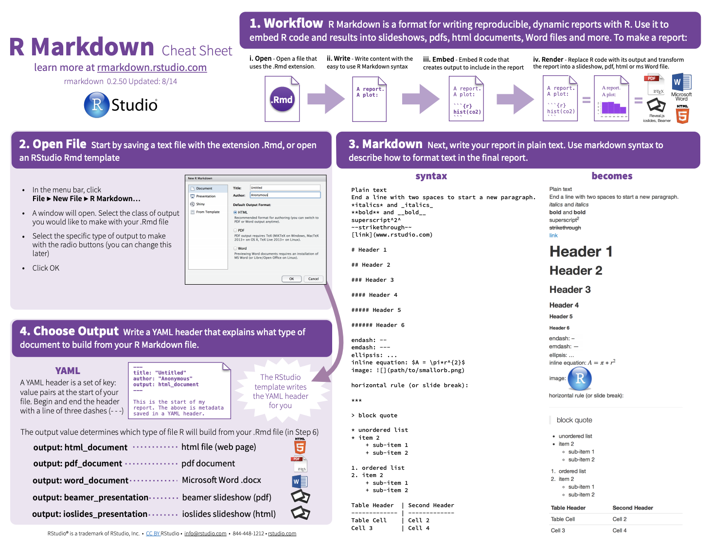

# The YAML   

YAMLs are the "set-up" for your Rmd file, indicated by three dashes to begin and end, and it can contain a series of information bits about the markdown document in between. Most important for us is the output, but this is a place to get more advanced (table of contents, LaTeX specification, ...).  

* What goes in a YAML also depends on the kind of output you have: 
PDF/LaTex, website, etc.  
  * See more: https://cran.r-project.org/web/packages/ymlthis/vignettes/yaml-fieldguide.html
<br>
* If you want to output as a pdf, you will need to set up LaTeX.  
  * See more: https://bookdown.org/yihui/rmarkdown-cookbook/install-latex.html
<br>

# Beginning at the end: knitting  

Use the knit button on the top bar to execute your entire script and create the output you have designated in your YAML. I recommend doing this often because I think that Markdown errors can be hard to read, and it may help you catch errors earlier.
<br>

# Markdown language (text)  

This is what allows us to write here, like a text editor, not a coding script. Rmd Cheat Sheet is a good place to start for the basics of the *Markdown* language.  

The link can be accessed here: https://rstudio.com/wp-content/uploads/2015/02/rmarkdown-cheatsheet.pdf  

Embed link:
[Cheat sheet](https://rstudio.com/wp-content/uploads/2015/02/rmarkdown-cheatsheet.pdf)  

Embed images  (remember that your working directory will set to your Rmd Directory, and so finding an image might be tough. You can use `../` before your filepath to move back one step in your folders, if need be)


Rmd is sensitive to spaces or non-spaces  
<br>
I want this to be the next line, so I needed to add 2 spaces at the end of the previous line  
<br>
Resources I am also a fan of:  

* [Pimp my Rmd](https://holtzy.github.io/Pimp-my-rmd/)
* [Rmd Cookbook](https://bookdown.org/yihui/rmarkdown-cookbook/)


# Rmd files can also contain R "chunks"  

These chunks are what allow you to embed code and coding outputs (plots) alongside your text. To generate a chunk: Cmd/Ctrl + Alt/Opt + i.  

The stuff inside the curly brackets is critical. These are your **chunk options**. You can name your chunks after `r` and before a comma.   

```{r setup, include = F}
library(tidyverse)
```


See cheatsheet for chunk options. IMO Important ones are:  

* echo = T: will include the code chunk
* include = F: will include the code chunk output or the code chunk
* results = c("asis"): asis is for LaTeX output
* fig.width = 7: default, but can adjust
* fig.height = 7: default, but can adjust
* warnings = F: prevent warnings from appearing
<br> 
```{r first chunk, echo = T, include = T}
# Look at built in data
head(storms)
```
<br>
```{r plot storms, echo = F, include = T}
storms %>% 
  ggplot() +
  geom_jitter(aes(x=as.factor(month), y = pressure, fill = wind),
              pch=21, alpha=0.5) +
  scale_fill_viridis_c() +
  theme_bw() +
  labs(title="Hurrican Pressure over months")


```
<br>

You can set defaults for your document and your chunk options with the following codes:  

```{r setup2, include=FALSE}
knitr::opts_chunk$set(echo = TRUE)

knitr::opts_knit$set(root.dir = "~/Desktop/R_DAVIS_2020/r-davis-in-class-project-lizawood5")
```
<br>

# Back to Markdown for more advanced elements

## Tables  

You can make a table in Markdown language alone:

| Table Title                       |
|-------------|----------|----------|
|             | Column 1 | Column 2 |
| Row 1       | 5        | 10       |
| Row 2       | 15       | 2        |

<br>
Or you can make a table in a code chunk. For this, there are a variety of table making packages: kable in knitr, gridextra, stargazer (mostly for model outputs). 

### knitr  

```{r kable, echo = T}
library(knitr)
kable(head(storms), caption = "Table with kable")
```

### htmlTable  

```{r htmltable, results = "asis", echo = T}
htmlTable::htmlTable(head(storms))
```

### xtable  
Better for PDF output, in my opinion, but worth knowing and seeing in html. If type is not specific, default is to LaTeX
```{r xtable, results = "asis", echo = T}
library(xtable)
options(xtable.comment = FALSE)
print(xtable(head(storms), caption = 'Table with xtable'), type = 'html')
```

### stargazer  

```{r stargazer, results = "asis", echo = T, message = F}
library(stargazer)
model <- lm(wind ~ pressure, data = storms)
# include a type argument as html for an html output, latex for PDF output, etc...
stargazer(model, type = "html")
```
<br>
**Personal note:** Tables in Rmd can get very frustrating, I think, especially when generating PDs. I prefer to use [TablesGenerator](https://www.tablesgenerator.com/) to create a table, then use the top tabs to pick the language I want the table to be in, generate it, and then paste the code generate at the bottom in the text portion of the Rmd file (i.e. not in a chunk).
<br>

### Equations  

To make equations, use LaTeX language, bracketed by dollar signs. Here is one of many LaTeX symbol sheets: https://www.caam.rice.edu/~heinken/latex/symbols.pdf  
<br>
And some examples:  

* Beta symbol: $\beta$    
* function of x: $f(x)$  
* Summation:  $\sum_{i=y}^n X_i$  


# Putting it all together with knitting  

Knitting is the moment of truth -- it combines everything in this file to create an output, BUT the output will not be created if there is an error in your code, or the code cannot be read linearly.  
<br>
Common issues:

* Naming chunks the same thing
* Having code out of order (one mistake breaks the whole thing)
<br>

# Give it a try  

Create a Rmd file with an html output, including the document title: "RMarkdown Test". Using the diamonds dataset, create a plot of your choice. Set the chunk options to display both the code and the plot, but not any warnings or other output from your code. Above your plot, describe the data and what the plot is showing, and try to use your new markdown skills (headers, bullets, bolding, etc). Knit it all together and see your output!