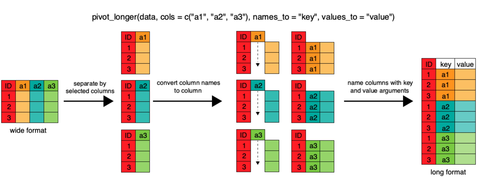

<br>
<div class = "blue">
## Learning objectives

* Use conditional statements to create new variables in a dataframe
* Use `join` functions to join two dataframes together
* Describe the concept of a wide and a long table format and for which purpose those formats are useful.
* Reshape a data frame from long to wide format and back with the `pivot_wider` and `pivot_longer` commands from the **`tidyr`** package.

</div>

<br>

## Conditional Statements  

When working with your data, you may want to create a new variable in a data frame, but only if a certain conditions are true. Conditional statements are a series of logical conditions that can help you manipulate your data to create new variables.

We'll begin again with our surveys data, and remember to load in the tidyverse

```{r,results = 'hide', purl = FALSE, warning=FALSE, message=FALSE}
library(tidyverse)
surveys <- read_csv("data/portal_data_joined.csv")
```

The general logic of conditional statements is this: if a statement is true, then execute x, if it is false, then execute y. For example, let's say that we want to create a categorical variable for hindfoot length in our data. Using the summary function below, we see that the mean hindfoot length is 29.29, so let's split the data at the mean using a conditional statement.

```{r}
summary(surveys$hindfoot_length)
```

### ifelse() function

To do this, we define the logic: if hindfoot length is less than the mean of 29.29, assign "small" to this new variable, otherwise, assign "big" to this new variable. We can call this `hindfoot_cat` to specify the categorical variable. We will first do this using the `ifelse()` function, where the first argument is a TRUE/FALSE statement, the second argument is the new variable if the statement is true, and the third argument is the new variable if the statement is false.
```{r}
surveys$hindfoot_cat <- ifelse(surveys$hindfoot_length < 29.29, "small", "big")
head(surveys$hindfoot_cat)
```

### case_when() function

The tidyverse provides a way to integrate conditional statements by combining `mutate()` with the conditional function: `case_when()`. This function uses a series of two-sided formulas where the left-hand side determines describes the condition, and the right supplies the result. The final condition should always be TRUE, meaning that when the previous conditions have not been met, assign the last value. Using this function we can re-write the `hindfoot_cat` variable using the tidyverse.

A note: Always be cautious about what might be left out when naming the conditions. In the previous `ifelse()` example we saw that NAs in the data remained NAs in the new variable construction. However, this is not so when using `case_when()`. Instead, this function takes the last argument to mean "anything that is left" rather than hindfoot_length > 29.29 == F. So when we run the equivalent conditions in this function, it assigns "small" where hindfoot_lengths are NA.

```{r}
surveys %>% 
  mutate(hindfoot_cat = case_when(
    hindfoot_length > 29.29 ~ "big",
    TRUE ~ "small"
  )) %>% 
  select(hindfoot_length, hindfoot_cat) %>% 
  head()
```

To adjust for this, we need to add in more than one condition:

```{r}
surveys %>% 
  mutate(hindfoot_cat = case_when(
    hindfoot_length > 29.29 ~ "big",
    is.na(hindfoot_length) ~ NA_character_,
    TRUE ~ "small"
  )) %>% 
  select(hindfoot_length, hindfoot_cat) %>% 
  head()
```

<div class = "blue">
### Challenge

Using the `iris` data frame (this is built in to R), create a new variable that categorizes petal length into three groups:  

* small (less than or equal to the 1st quartile)
* medium (between the 1st and 3rd quartiles) 
* large (greater than or equal to the 3rd quartile)  

Hint: Explore the iris data using `summary(iris$Petal.Length)`, to see the petal length distribution. Then use your function of choice: `ifelse()` or `case_when()` to make a new variable named `petal.length.cat` based on the conditions listed above. Note that in the `iris` data frame there are no NAs, so we don't have to deal with them here.

<details>
<summary>ANSWER</summary>
```{r challenge1, purl=FALSE}

iris$petal.length.cat <- ifelse(iris$Petal.Length <= 1.6, "low", 
                          ifelse(iris$Petal.Length > 1.6 & 
                                   iris$Petal.Length < 5.1, "medium",
                           "high"))

iris %>% 
  mutate(
    petal.length.cat = case_when(
      Petal.Length <= 1.6 ~ "small",
      Petal.Length > 1.6 & Petal.Length < 5.1 ~ "medium",
      TRUE ~ "large")) %>% 
  head()

```
 </details>
</div>
<br>

## Joining two dataframes 

Often when working with real data, data might be separated in multiple .csvs. The `join` family of dplyr functions can accomplish the task of uniting disparate data frames together rather easily. There are many kind of `join` functions that dplyr offers, and today we are going to cover the most commonly used function `left_join`. 

To learn more about the `join` family of functions, check out this [useful link](https://dplyr.tidyverse.org/reference/join.html). 

Let's read in another dataset. This data set is a record of the tail length of every rodent in our `surveys` dataframe. For some annoying reason, it was recorded on a seperate data sheet. We want to take the tail length data and add it to our surveys dataframe. 

```{r, message=FALSE}
tail <- read_csv("data/tail_length.csv")
```

The `join` functions join dataframes together based on shared columns between the two data frames. Luckily, both our `surveys` dataframe and our new `tail_length` data frame both have the column `record_id`. Let's double check that our record_id columns in the two data frames are the same by using the `summary` function. 

```{r}
summary(surveys$record_id) #just summarize the record_id column by using the $ operator 

summary(tail$record_id)
```

Looks like all those values are identical. Awesome! Let's join the dataframes together. 

The basic structure of a `join` looks like this:

`join_type(FirstTable, SecondTable, by=columnTojoinBy)`

#### There are many different kinds of join types:

- `inner_join` will return all the rows from Table A that has *matching values* in Table B, and all the columns from both Table A and B

- `left_join` returns all the rows from Table A with all the columns from both A and B. Rows in Table A that have no match in Table B will return NAs

- `right_join` returns all the rows from Table B and all the columns from table A and B. Rows in Table B that have no match in Table A will return NAs. 

- `full_join` returns all the rows and all the columns from Table A and Table B. Where there are no matching values, returns NA for the one that is missing. 

For our data we are going to use a `left_join`. We want all the rows from the `survey` data frame, and we want all the columns from both data frames to be in our new data frame. 

```{r}

surveys_joined <- left_join(surveys, tail, by = "record_id")

```

If we don't include the `by = ` argument, the default is to join by all the variables with common names across the two data frames. 


<div class = "blue">
### Challenge

1. Filter the data so that only species_id = NL,and call this `surveysNL`  
2. Join the `tail` data to the `surveysNL` data (i.e. left join with `surveysNL` on the left). Name it `surveysNL_tail_left`. How many rows are there?  
3. Join the `surveysNL` data to the `tail data` (i.e. right join with `surveysNL` on the left). Name it `surveysNL_tail_right`. How many rows are there?   

<details>
<summary>ANSWER</summary>   
```{r, purl=FALSE}
# 1.  
surveysNL <- surveys %>% 
  filter(species_id == "NL") #filter to just the species NL

# 2.
surveysNL_tail_left <- left_join(surveysNL, tail, by = "record_id") #a new column called tail_length was added
nrow(surveysNL_tail_left)

# 3.
surveysNL_tail_right <- right_join(surveysNL, tail, by = "record_id") #a new column called tail_length was added
nrow(surveysNL_tail_right)

```

 </details>
</div>
<br>

## Reshaping with pivot functions

In the spreadsheet lesson we discussed how to structure our data leading to the four rules defining a tidy dataset:

1. Each variable has its own column
2. Each observation has its own row
3. Each value must have its own cell
4. Each type of observational unit forms a table

Here we examine the fourth rule: Each type of observational unit forms a table.

In `surveys` , the rows of `surveys` contain the values of variables associated
with each record (the unit), values such the weight or sex of each animal 
associated with each record. What if instead of comparing records, we 
wanted to compare the different mean weight of each species between plots? (Ignoring `plot_type` for simplicity).

We'd need to create a new table where each row (the unit) is comprise of values of variables associated with each plot. In practical terms this means the values
of the species in `genus` would become the names of column variables and the cells would contain the values of the mean weight observed on each plot.

Having created a new table, it is therefore straightforward to explore the 
relationship between the weight of different species within, and between, the
plots. The key point here is that we are still following a tidy data structure,
but we have **reshaped** the data according to the observations of interest:
average species weight per plot instead of recordings per date.

The opposite transformation would be to transform column names into values of
a variable.

We can do both these of transformations with two new `tidyr` functions, `pivot_longer()` and `pivot_wider()`.

### `pivot_wider`

`pivot_wider()` widens data by *increasing* the number of columns and *decreasing* the number of rows. It takes three main arguments:

1. the data
2. `names_from` the name of the column you'd like to spread out
3. `values_from` the data you want to fill all your new columns with 

Let's try an example using our surveys data frame. Let's pretend we are interested in what the mean weight is for each species in each plot. How would we create a dataframe that would tell us that information? 

First, we need to calculate the mean weight for each species in each plot:
```{r}
surveys_mz <- surveys %>% 
  filter(!is.na(weight)) %>% 
  group_by(genus, plot_id) %>% 
  summarize(mean_weight = mean(weight)) 

str(surveys_mz) #let's take a look at the data

```
In `surveys_mz` there are 196 rows and 3 columns. Using `pivot_wider` we are going to *increase* the number of columns and *decrease* the number of rows. We want each row to signify a single genus, with their mean weight listed for each plot id. How many rows do we want our final data frame to have?

```{r}

unique(surveys_mz$genus) #lists every unique genus in surveys_mz

n_distinct(surveys_mz$genus) #another way to look at the number of distinct genera

```
There are 10 unique genera, so we want to create a data frame with just 10 rows. How many columns would we want? Since we want each column to be a distinct plot id, our number of columns should equal our number of plot ids. 
```{r}
n_distinct(surveys_mz$plot_id)
```
Alright, so we want a data frame with 10 rows and 24 columns. `pivot_wider` can do the job! 
```{r}
wide_survey <- surveys_mz %>% 
  pivot_wider(names_from = "plot_id", values_from =  "mean_weight")

head(wide_survey)
```

### `pivot_longer`

`pivot_longer` lengthens data by *increasing* the number of rows and *decreasing* the number of columns. This function takes 4 main arguments: 

1. the data 
2. `cols`, the column(s) to be pivoted (or to ignore)
3. `names_to` the name of the new column you'll create to put the column names in
4. `values_to` the name of the new column to put the column values in



Let's pretend that we got sent the dataset we just created (`wide_survey`) and we want to reshape it to be in a long format. We can easily do that using `pivot_longer`

```{r, purl=FALSE}
#cols = columns to be pivoted. Here we want to pivot all the plot_id columns, except the colum "genus"
#names_to = the name of the new column we created from the `cols` argument 
#values_to = the name of the new column we will put our values in

surveys_long <- wide_survey %>% 
  pivot_longer(col = -genus, names_to = "plot_id", values_to = "mean_weight")

```
This data set should look just like `surveys_mz`. But this one is 240 rows, and `surveys_mz` is 196 rows. What's going on? 

```{r}
View(surveys_long)
```

Looks like all the NAs are included in this data set. This is always going to happen when moving between `pivot_longer` and `pivot_wider`, but is actually a useful way to balance out a dataset so every replicate has the same composition.  Luckily, we now know how to remove the NAs if we want! 
```{r}
surveys_long <- surveys_long %>% 
  filter(!is.na(mean_weight)) #now 196 rows
```

`pivot_wider` and `pivot_longer` are both new additions to the `tidyverse` which means there are some cool new blog posts detailing all their abilities. If you'd like to read more about this group of functions, check out these links:

- [Blog post by Burno Rodrigues](https://www.brodrigues.co/blog/2019-03-20-pivot/)
- [tidyr's vignette](https://tidyr.tidyverse.org/dev/articles/pivot.html)
- [Hiroaki Yutani's slides](https://speakerdeck.com/yutannihilation/a-graphical-introduction-to-tidyrs-pivot-star?slide=1)

<div class = "blue">
### Challenge

1. Use `pivot_wider` on the `surveys` data frame with `year` as columns, `plot_id` as rows, and the number of genera per plot as the values. You will need to summarize before
  reshaping, and use the function `n_distinct()` to get the number of unique
  genera within a particular chunk of data.  
2. The `surveys` data set has two measurement columns: `hindfoot_length` and `weight`.  This makes it
   difficult to do things like look at the relationship between mean values of
   each measurement per year in different plot types. Let's walk through a
   common solution for this type of problem. First, use `pivot_longer()` to create a
    dataset where we have a new column called `measurement` and a
   `value` column that takes on the value of either `hindfoot_length` or
   `weight`. *Hint*: You'll need to specify which columns are being selected to make longer.  
Then with this new data set, calculate the average of each
   `measurement` for each different `plot_type`. Then
   use `pivot_wider()` to get them into a data set with a column for `hindfoot_length` and
   `weight`. *Hint*: You only need to specify the `names_from =` and `values_from =`
    columns

<details>
<summary>ANSWER</summary>   
```{r, purl=FALSE}
## Answer 1
q1 <- surveys %>%
  group_by(plot_id, year) %>%
  summarize(n_genera = n_distinct(genus)) %>%
  pivot_wider(names_from = "year", values_from = "n_genera")

head(q1)

## Answer 2
q2a <- surveys %>%
  pivot_longer(cols = c("hindfoot_length", "weight"), names_to = "measurement_type", values_to = "value")

#cols = columns we want to manipulate 
#names_to = name of new column
#values_to = the values we want to fill our new column with (here we already told the function that we were intersted in hindfoot_length and weight, so it will automatically fill our new column, which we named "values", with those numbers.)

q2b <- q2a %>% 
  group_by(measurement_type, plot_type) %>% 
  summarize(mean_value = mean(value, na.rm=TRUE)) %>% 
  pivot_wider(names_from = "measurement_type", values_from = "mean_value")
head(q2b)
```
 </details>
</div>
<br>

## Exporting data

Now that you have learned how to use **`dplyr`** to extract information from
or summarize your raw data, you may want to export these new datasets to share
them with your collaborators or for archival.

Similar to the `read_csv()` function used for reading CSV files into R, there is
a `write_csv()` function that generates CSV files from data frames.

Before using `write_csv()`, we are going to create a new folder, `data_output`,
in our working directory that will store this generated dataset. We don't want
to write generated datasets in the same directory as our raw data. It's good
practice to keep them separate. The `data` folder should only contain the raw,
unaltered data, and should be left alone to make sure we don't delete or modify
it. In contrast, our script will generate the contents of the `data_output`
directory, so even if the files it contains are deleted, we can always
re-generate them.

 - Type in `write_` and hit TAB. Scroll down and take a look at the many options that exist for writing out data in R. Use the F1 key on any of these options to read more about how to use it.
 
