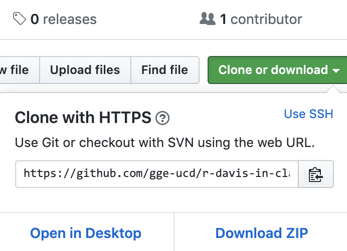
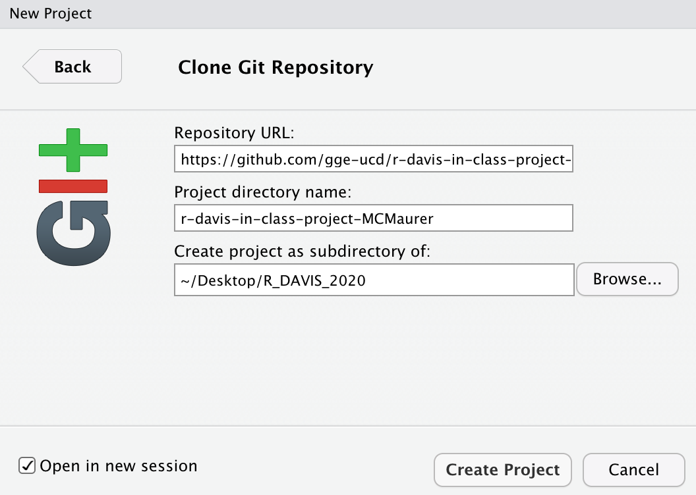

Once we've setup R/RStudio, and installed git, the next step is seeing whether we can connect RStudio with Git. Please try this at home before class, and then we'll go through it when we meet.

 

**This lesson assumes you have:**

- registered for your free Github account
- installed **R**, **RStudio**, and **git**
- Filled out our google form and accepted your invitation to the repository in our [`GGE-R-DAVIS` group](https://github.com/gge-ucd)

 
This lesson is to demonstrate the basics of using git with RStudio, and should provide a basic understanding of why we want to use version control where possible. 

 

## Introduction to Version Control

At some point many of us have probably had files in a directory that may have looked like this (*[from PHDcomics](http://phdcomics.com/comics/archive.php?comicid=1323)*): 

Version control gives you a better way to track changes for things like data files and code, and in a more manageable way. That’s important because when the reviews come back on your paper and ask you to perform some additional analyses and you open up this directory, it can be pretty difficult to figure out which file you should actually use. At the very least you’ll spend a bunch of extra time figuring it out before you get to work, or at worst you may pick the wrong file and then have to redo all your work after realizing the results weren't the same as in the submitted version of the manuscript. For much more detail on setting git with R (or troubleshooting), see the [happygitwithr.com](http://happygitwithr.com/) website.

 

### Benefits of Version Control

  - *Track changes on steroids*
    - Tracks every change ever made in groups called commits
    - Every commit stores the full state of all of your files at that time
    - Never lose anything
    - Easily unbreak your code/data/manuscript
    - No more file name changes
    
  - *Collaboration*
    - Work on things simultaneously
    - See what changes others have made
    - Everyone has the most recent version of everything
    

 

## Connecting RStudio & Github

For our purposes the "*best practice*" (i.e., **easier**) for setting up a new github repository in RStudio is through an RStudio *Project*. First, ideally what we want to do is create a new repository on [Github](https://github.com/), then create a new RStudio Project to **clone** (copy) our repository onto our computer (a local version). See the steps below.

 

### 1. Create a new repository on Github

 - Typically, the preferred method is to create a new repository on Github...**HOWEVER**:
 - For this class we've already created a repository for you, and you will get a Github Classroom link via email. When you click the link, Github creates a new repository for you, which our class will be able to view and work with.
 - When you use the Github Classroom link, a repository will be created that looks like "gge-ucd/r-davis-in-class-project-YourGithubUsername"

### 2. Clone your repository to your computer

You should now have a repository on Github. Our class is all housed in the [gge-ucd](https://github.com/gge-ucd) Organization, so your repository should appear there, and it should look something like this:

  - [`https://github.com/gge-ucd/r-davis-in-class-project-YourGithubUsername`](https://github.com/gge-ucd/r-davis-in-class-project-MCMaurer). Take a minute to navigate to your repo online and take a look at your `README.md` file by clicking on it. 
  - **To _`clone`_ your repository** (i.e. copy to your computer):
      - We're going to stick with using **`HTTPS`:** for now. Look for the big green "*Clone or download*" button. Make sure you select the "**Use HTTPS**" so the top of the box says: **Clone with HTTPS**. 
      - Copy that link (should be something like *`https://github.com/gge-ucd/r-davis-in-class-project-YourGithubUsername.git`*).
 

**If you see this box, but it says "Clone with SSH", just click "Use HTTPS" in the top right of the box.**

 

### 3. Create a New Version Controlled (`git`) RStudio Project

Now we'll create an RStudio Project and link our Github repository (following [*Section 13.3* of `happygitwithR`](http://happygitwithr.com/rstudio-git-github.html#clone-the-new-github-repository-to-your-computer-via-rstudio)).

  - In RStudio, start a new Project: `File > New Project > Version Control > Git`. 
  

  - In the “**Repository URL**” paste the URL of your new GitHub repository. If you hit **`Tab`**, the *Project directory name* will automatically populate with the exact name of the repository. This is generally preferred so you can keep track of things more easily. You should put this project into a subdirectory, which will be **Desktop/R_DAVIS_2020** for this class. You should make a folder on your desktop called **R_DAVIS_2020** spelled **EXACTLY** like that, and put your new GitHub repository into that folder. It should look like this:
  

 

For the rest of this class, **everything** we do will be in the R_DAVIS_2020 folder on your Desktop. For the rest of your life, however, you can put GitHub repositories anywhere on your computer, but it's really useful to keep them well organized. A common way to do this would be a folder under your username called "GitHub_Projects" or something like that.

Another critical thing with git and GitHub is that you should **never** nest projects inside of projects. Treat each RProject/git repository as a completely separate entity, containing only the stuff pertaining to that project. If you try to put a folder that's an RProject inside another folder that's an RProject, stuff is gonna go wrong. Just keep them all separate, but ideally contained in some other folder, like "GitHub_Projects", which is NOT a GitHub repository or RProject, just a boring regular folder.

  - This new subdirectory that you specified will be all these things:
    - a directory on your computer
    - a local Git repository, linked to a remote GitHub repository
    - an RStudio Project
    - it should contain a `README.md` file with some content that we've created...we'll edit that next.
    - it should have a data folder with some data we'll use soon
    
<!-- STOP and check in here...have folks gotten this part? Are there questions? Ask some paired/group questions?-->

 

#### *IF YOU MADE IT THUS FAR CONGRATS!*

 

### 4. Push & Commit Changes to your `README.md`

We'll go over this part in class. If you successfully created your RStudio project, you've done most of the hard work...what remains is:

 - Test whether we can make changes or **edit** our README on our local `master` branch (copy of the repository on your computer).
 - **`commit`** these changes (make a version control record of your change/s)
 - **`push`** these change back to the `remote` which is the copy of the repository on Github.com.

 

#### Edit README

In RStudio, open your new project (`r-davis-in-class-project-YourGithubUsername`). Navigate to the *Files* tab and open the `README.md` file. You can click on it in the window and it will automatically open up.

  - **Edit your README by adding in the following:**
    - Name
    - Preferred pronouns
    - General research area/interest
    - Delete all the original text in the README, leaving just the information about you

 

#### Stage & Commit to Git

  - Click on the **Git** tab. When you click on the git tab, you should see the `README.md`, and a `.Rproj` file, and perhaps a few other files. That's ok!
  
  - Click on the small box to the left of the `README.md` to stage the file. Then click the `commit` button. You'll see a new widow, on the upper right you need to type a `commit` message, something simple, short, and descriptive. Then click the `commit` button. You should see a little box with message committed.
  
  - Finally before you close everything, hit the **PUSH** button. This *pushes* the changes to the github repository (you may need to enter your Github username & password once depending on whether you used `https` or `ssh`).
  
  - If you go back to the repository in your browser and refresh the page, you should see the changes you've made. Equally important, any collaborator or instructor can now `pull` those exact changes into a copy of the repo on our computer.

Hopefully that all worked! You can now push and pull from your repository.

 
Parts of these instructions were adapted from those written by Ethan White for his [Data Carpentry for Biologists](http://www.datacarpentry.org/semester-biology/) course, and from Jenny Bryan's [happygitwithr.com](http://happygitwithr.com/) website.